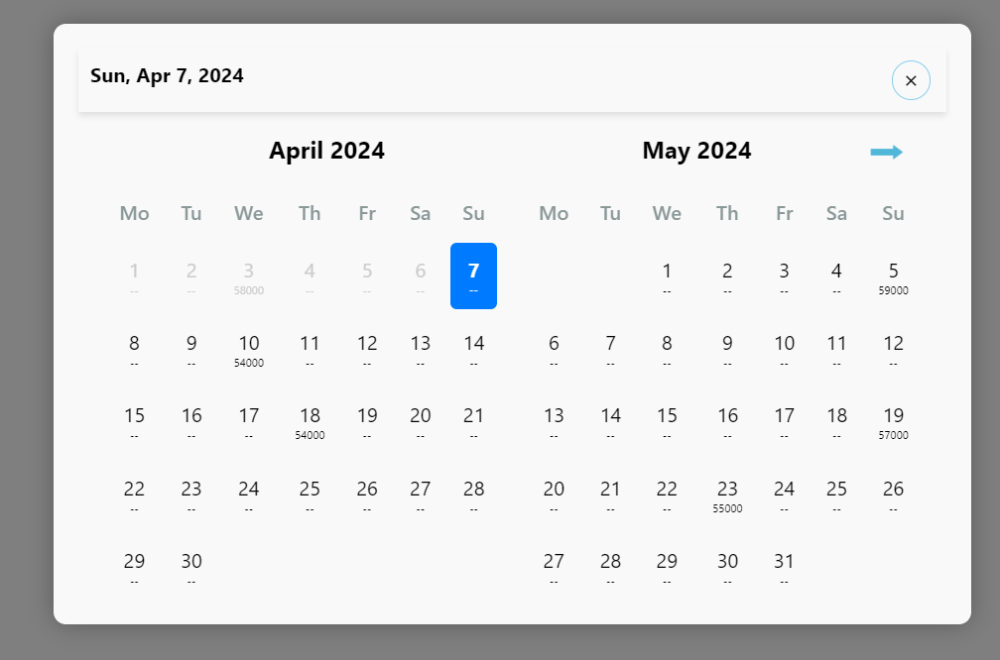
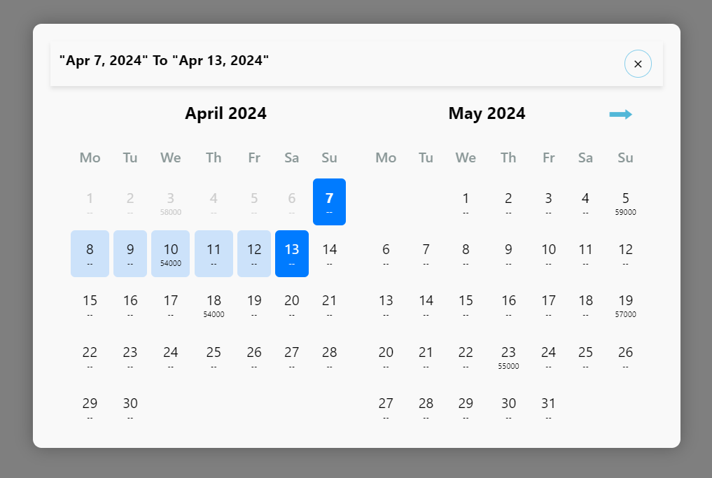

# React Calendar Value

React Calendar Value is a versatile and customizable calendar component for managing date selections and values in React applications.


<br/>



## Installation

You can install the React Calendar Value package using npm or yarn.

Using npm:

```

npm install react-calendar-value

```

Using yarn:

```

yarn add react-calendar-value

```

Once installed, you can import the component in your React application and start using it.


# Usage

## Note

The value of the Dates should be in this format only ()
```jsx

const data = [
    {"24-02-2024": "56000"},
    {"12-03-2024": "62000"},
    {"03-04-2024": "58000"},
    {"18-04-2024": "54000"},
    {"05-05-2024": "59000"},
    {"19-05-2024": "57000"},
    {"23-05-2024": "55000"},
    {"15-02-2024": "53000"},
    {"07-03-2024": "57000"},
    {"29-03-2024": "60000"},
    {"10-04-2024": "54000"}
];

// Format = {"dd-mm-yyyy" : value};

```


## 1. DatePicker

Import the DatePicker use it in your React application:

```jsx
import React, { useEffect, useState } from "react";
import DatePicker from "react-calendar-value";
import { data } from "./Data";

export default function App() {
  // State variables for managing the visibility of the calendar, selected date, and messages
  let [show, setShow] = useState(false);
  let [selectedDate , SetSelectedDate] = useState(new Date());
  let [messages , setMessages] = useState(null);

  // Update the messages when the selected date changes
  useEffect(() => {
    if(selectedDate){
      setMessages(selectedDate.toLocaleDateString("en-US", {
        weekday: "short",
        year: "numeric",
        month: "short",
        day: "numeric",
      }));
    } else {
      setMessages(null);
    }
  }, [selectedDate]);

  return (
    <div>
      {/* Title */}
      <div>Date Picker</div>
      
      {/* Button to toggle the visibility of the calendar */}
      <button onClick={() => setShow(!show)}>Show Calendar</button>
      
      {/* DatePicker component */}

      <DatePicker

        // Mandatory
        show={show} // Boolean indicating whether to show the calendar
        setShow={setShow} // Function to toggle the visibility of the calendar
        CalenderValues={data} // Array of objects containing date-value pairs for calendar values
        selectedDate={selectedDate} // Currently selected date
        setSelectedDate={SetSelectedDate} // Function to set the selected date
        HeadingMessage={messages} // Message to display as the heading in the calendar
        
        // Optional
        closeWhenClickOutside={false} // Boolean indicating whether to close the calendar when clicking outside of it
        showCloseButton={true} // Boolean indicating whether to show the close button in the calendar
        disableDatesBeforeSelectedDate={false} // Boolean indicating whether to disable dates before the selected date
        numberOfMonthsToShow={3} // Number of months to show in the calendar
        DisableBeforeDates={true} // Boolean indicating whether to disable dates before today
        DisableBeforeMonths={true} // Boolean indicating whether to disable dates before the current month
        showBackgroundDull={true} // Boolean indicating whether to show a dull background when the calendar is open
      />
    </div>
  );
}


```


## 2. DateRangePicker

Import the DateRangePicker use it in your React application:

```jsx
import React, { useEffect, useState } from "react";
import DateRangePicker from "react-calendar-value";

/**
 * DateRangePicker component demonstrates the usage of the DateRangePicker component.
 * It allows users to select a date range and displays the selected date range along with a calendar for date picking.
 */

export default function App() {

  // State variables for managing the visibility of the calendar and selected dates
  const [show, setShow] = useState(false);
  const [selectedDate1, setSelectedDate1] = useState(new Date());
  const [selectedDate2, setSelectedDate2] = useState("");

  // Format the selected date for display in the heading message
  const formatSelectedDate = (date) => {
    if (!date) return "";
    const options = { year: "numeric", month: "short", day: "numeric" };
    return date.toLocaleDateString("en-US", options);
  };

  return (
    <div>

      <div>Date Range Picker</div>

      {/* Button to toggle the visibility of the calendar */}
      <button onClick={() => setShow(!show)}>Show Calendar</button>

      {/* DateRangePicker component */}
      <DateRangePicker

        // Mandatory
        show={show} // Boolean indicating whether to show the calendar
        setShow={setShow} // Function to toggle the visibility of the calendar
        selectedDate1={selectedDate1} // Start date of the selected date range
        setSelectedDate1={setSelectedDate1} // Function to set the start date
        selectedDate2={selectedDate2} // End date of the selected date range
        setSelectedDate2={setSelectedDate2} // Function to set the end date
        CalenderValues={data} // Array of objects containing date-value pairs for calendar values

        // Optional
        showCloseButton={true} // Boolean indicating whether to show the close button in the calendar
        closeWhenClickOutside={false} // Boolean indicating whether to close the calendar when clicking outside of it
        disableDatesBeforeSelectedDate={true} // Boolean indicating whether to disable dates before the selected date
        HeadingMessage={`"${formatSelectedDate(selectedDate1) === "" ? '________' : `${formatSelectedDate(selectedDate1)}`}" To "${formatSelectedDate(selectedDate2) === "" ? '________' : `${formatSelectedDate(selectedDate2)}`}"`} // Message to display as the heading in the calendar
        numberOfMonthsToShow={4} // Number of months to show in the calendar
        DisableBeforeDates={true} // Boolean indicating whether to disable dates before today
        DisableBeforeMonths={true} // Boolean indicating whether to disable dates before the current month
        showBackgroundDull={true} // Boolean indicating whether to show a dull background when the calendar is open
      />
    </div>
  );
}


```


## Contributing

Contributions, bug reports, and feature requests are welcome. Feel free to open an issue or submit a pull request on the [GitHub repository](https://github.com/ps8847/react-calendar-value.git).

## License

This project is licensed under the [MIT License](LICENSE).

```

```
